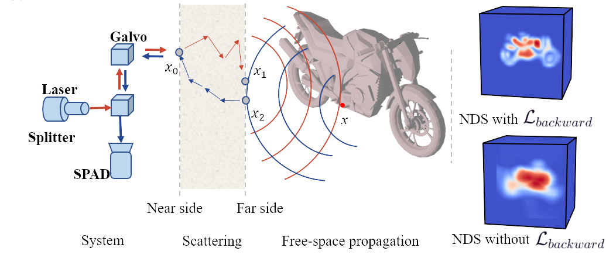

# Neural Reconstruction through Scattering Media with Forward and Backward Losses



## [Project page](https://github.com/hazelzz/netf-torch-ngp/) | [Paper](https://ieeexplore.ieee.org/abstract/document/10233796) 

## Install

```bash
conda install pytorch==2.1.0 torchvision==0.16.0 torchaudio==2.1.0 pytorch-cuda=11.8 -c pytorch -c nvidia
cd freqencoder
pip install .
cd ../gridencoder
pip install .
cd ../shencoder
pip install .
```

```bash

pip install -r requirements.txt

# (optional) install the tcnn backbone
```

<!-- ### Install with conda
```bash
conda env create -f environment.yml
conda activate torch-ngp
``` -->

### Install encodings
```bash
cd *encoder/
pip install .
```

## Repo Org
```
├── configs                                                                                                       
│   ├── ...                                                                                     
│                                                                                           
├── data                                                                                                       
│   ├── ...                                                                                     
│     
├── logs  # experiment logs                                                                                                                                                                                               
│   ├── experiment 1                                                                                                  
│   │   └── result # reconstructed volume                                                                                                                             
│   │   └── histogram # rendered histogram                                                                                  
│   │   └── Image   # rendered image
|   |   └── model # saved model
|   ├── experiment 2
|   |   └── ...
```

## Train

```bash
python run.py --config <path to config>
```
Example:
```bash
python run.py --config configs/cudaGL/bike_nonconfocal_cdt_shift_32_0.015_1_render.txt
```
Parameters are modified in the config file.

Explanation: 

- `expname` experiment name
- `basedir` where to store ckpts and logs
- `datadir` input data directory
- `dataset_type` options: nlos / genrated
- `neglect_zero_bins` when True, those zero histogram bins - will be neglected and not used in optimization. The - threshold is computed automatically to ensure that n eglected -bins are zero
- `neglect_former_nums` nums of former values ignored
- `neglect_back_nums` nums of back values ignored

- `encoding` encoding type for position
- `encoding_dir` encoding type for direction
- `num_layers` the number of layers for sigma
- `hidden_dim` the dimmension of hidden layer for sigma net
- `geo_feat_dim` the dimmension of geometric feature
- `num_layers_color` the number of layers for color
- `hidden_dim_color` the dimmension of hidden layer for color - net
- `bound` boundry of the scene
- `reso` the result resolution
- `trim` The length of the value is discarded at the backward - loss step 
- `snr` SNR in wiener filter 
- `loss_type` use only forward, backward only, or both
- `N_iters` num of training iters
- `lrate` learning rate
- `lr_decay_rate` learning rate decay rate
- `sampling_points_nums` number of sampling points in one direction, so the number of all sampling points is the square of this value
- `n` refractive index
- `mu_a` absorption coefficient
    parser.add_argument("--mu_s", type=float, default=0, 
                        help='scattering coefficient')
    parser.add_argument("--zd", type=float, default=0, 
                        help='thickness of the scattering medium')
    parser.add_argument("--n_dipoles", type=int, default=0, 
                        help='number of dipoles')

### Train

### Train


## Acknowledgement

We have intensively borrow codes from the following repositories. Many thanks to the authors for sharing their codes.

- [torch-ngp] https://github.com/ashawkey/torch-ngp
- [NeTF] https://github.com/SCI2020/NeTF 
- [confocal-diffuse-tomography] https://github.com/computational-imaging/confocal-diffuse-tomography
